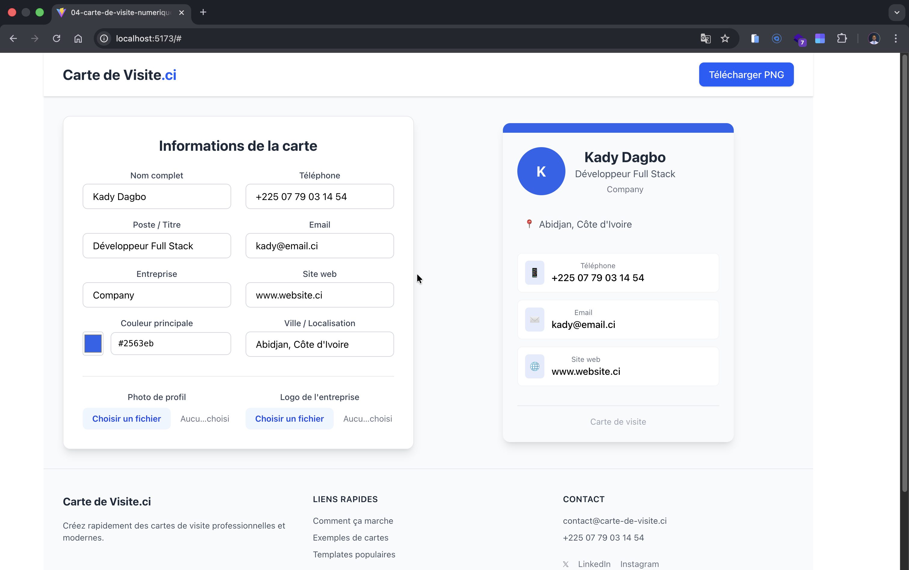

# Carte de visite numérique

## 📋 Description

Projet 04 de la série **100 projets en 1 an**
Créez rapidement des cartes de visite professionnelles, élégantes et personnalisables directement dans votre navigateur.

---

## ✨ Fonctionnalités

- Saisie en temps réel des informations (nom, poste, entreprise, téléphone, email, site web, localisation…)
- Aperçu instantané de la carte de visite
- Choix de couleur principale
- Ajout de photo de profil et logo
- Design responsive (mobile + desktop)
- Interface moderne et intuitive avec Tailwind CSS

---

## 🗂️ Structure du projet

```
01_Contact_management/
│
├── node_modules/                     # Modules Node.js
├── public/
│   └── img.png
├── src/
│   ├── components/
│   │   ├── Card.jsx                  # La carte de visite elle-même
│   │   ├── Menu.jsx                  # Formulaire de saisie + options
│   │   ├── Navbar.jsx                # Barre de navigation + bouton télécharger
│   │   └── Footer.jsx                # Pied de page
│   ├── App.jsx
│   ├── main.jsx
│   └── index.css                     # Import Tailwind + styles globaux
├── package.json                      # Dépendances et scripts
├── package-lock.json                 # Verrouillage des versions
├── README.md                         # Documentation du projet
├── vite.config.js                    # Configuration Vite
└── .gitignore                        # Fichiers ignorés par Git
```

---

## 🛠️ Technologies utilisées

- **React** + **Vite**
- **Tailwind CSS**
- **JavaScript** (pas de TypeScript dans cette version)

---

## 🚀 Installation et utilisation

1. **Cloner le projet** :

   ```bash
   git clone https://github.com/dagbokady/04-Carte-de-visite-Numerique.git
   ```

2. **Installer les dépendances** :

   ```bash
   npm install
   ```

3. **Lancer l’application** :

   ```bash
   npm run dev
   ```

4. **Accéder à l’application** :
   Ouvrez le navigateur à l’URL indiquée dans le terminal (souvent `http://localhost:5173`).

---

## 🎨 Personnalisation

### Modifier la typographie

Vous pouvez changer la police de l’application dans `index.css` :

```css
body {
    margin: 0;
    display: flex;
    place-items: center;
    min-width: 320px;
    min-height: 100vh;
    font-family: Avenir, Helvetica, Arial, sans-serif;
}
```

### Couleurs et styles

* Modifier les couleurs et les styles des boutons ou badges dans les fichiers CSS correspondants (`App.css`, `Index.css`, etc.)
* Le style peut aussi être modifié directement dans les classes de composants

---

## 🤝 Contribution

Vous pouvez contribuer à ce projet pour proposer des améliorations ou corriger des bugs :

1. Forkez le projet
2. Créez une branche pour votre fonctionnalité :

   ```bash
   git checkout -b ma-fonctionnalite
   ```
3. Committez vos changements :

   ```bash
   git commit -m "Ajout d'une nouvelle fonctionnalité"
   ```
4. Pushez vers votre branche :

   ```bash
   git push origin ma-fonctionnalite
   ```
5. Ouvrez une Pull Request

---

## 📄 Licence

Ce projet est libre de réutilisation et modification.

---
## 🎇 Image de l'application




---

## ✉️ Contact

Pour toute question ou retour :

* **Auteur** : DAGBO KADY CHRIST-PHANUEL
* **Email** : [dagbokady@gmail.com](mailto:dagbokady@gmail.com)

---

**Dernière mise à jour : 22-01-2026** ✅

---

